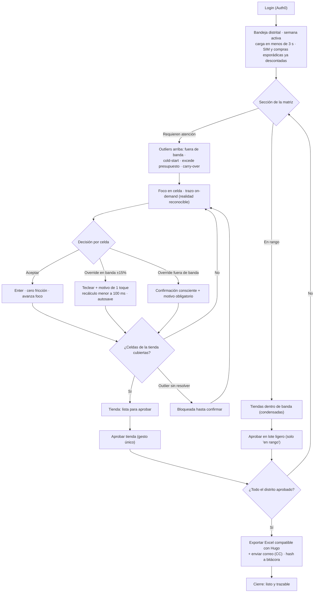
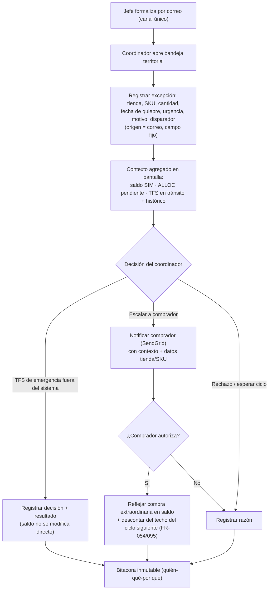

# UX Design Specification — insumos-odemas

**Author:** Jonathan
**Date:** 2026-05-27

---

<!-- El contenido del diseño UX se irá agregando secuencialmente a través de los pasos colaborativos del workflow -->

## Resumen Ejecutivo

### Visión del Proyecto

insumos-odemas reemplaza el cálculo manual de la consolidación distrital semanal de
insumos de papel para los 226 servicentros de Office Depot México. Hoy cada uno de los
3 coordinadores invierte ~9 h/semana armando a mano su parte del
`SolicitusDeInsumosTodos.xlsx`; el sistema predice la demanda por tienda × SKU (motor
Java, ~99% basado en ventas), aplica un factor único de pérdida por tipo de papel,
descuenta inventario en tránsito (ALLOC/TFS) y saldo SIM, valida el techo presupuestal
y **presenta una sugerencia con trazo explicable que el coordinador revisa y aprueba
en pantalla**. El Excel deja de ser la herramienta de trabajo y pasa a ser únicamente
el handoff hacia compras. Meta de UX medible: bajar de 9 h a **< 2 h por coordinador
por semana**.

El producto vive en 3 fases (Predicción → Inventario/solicitud → Rebajas/merma); esta
especificación cubre la **Fase 1 más el soporte a la consolidación** (v1).

### Usuarios Objetivo

**Coordinador territorial (usuario interactivo principal — 3 personas: Carlos, Marco,
Eduardo).** Power-users de Excel, full-time en servicentro con responsabilidades más
allá del inventario. Prefieren teclado sobre mouse. Trabajan en **laptop corporativa
(~1366×768)**, una vista principal a la vez. Operan en tres modos dentro del sistema:
(a) **bandeja distrital** — consolidación semanal de ~38 tiendas en ciclo; (b) **bandeja
territorial** — excepciones mid-cycle formalizadas por correo, configuración del factor
de pérdida y análisis del histórico TFS; (c) **consulta** del dashboard pedido-vs-recibido.
Concurrencia máxima: 3 coordinadores simultáneos.

**Administrador (usuario de configuración).** Gobierna datos maestros (tiendas, SKUs,
equivalencias, tipos de papel, coordinadores), catálogo de eventos comerciales, lista de
razones estructuradas, `buffer_seguridad` y umbrales. Requiere MFA.

**No-usuarios relevantes para el diseño:** el **jefe de servicentro** no opera el sistema
en v1 (sigue capturando en SIM y enviando su Excel por correo) — pero su ausencia define
qué estados *no* existen en la bandeja (no hay "pendiente captura jefe"). El **comprador
(Hugo)** es consumidor downstream: solo recibe el Excel exportado, compatible bit-a-bit
con la estructura de referencia.

### Retos Clave de Diseño

1. **Confianza vs. corrección con fricción mínima.** El coordinador debe creer en la
   sugerencia del motor (vía trazo explicable) y a la vez poder corregirla sin esfuerzo
   — en los ciclos 1-3 el override es "oro de calibración" (meta ≥25%). La UI tiene que
   hacer ambas cosas verdaderas al mismo tiempo: sugerencia creíble y override trivial,
   con razón estructurada obligatoria sin que sea un peaje.

2. **Densidad de datos en una laptop de 1366×768.** ~38 tiendas × N SKUs, agregados de
   distrito, trazo, validación presupuestal y estados por tienda compitiendo por un
   espacio reducido. La vista por SKU → tiendas (D-11), paneles colapsables, AG Grid con
   virtual scroll y jerarquía visual estricta son la única salida.

3. **Traducción al modelo mental del comprador (locale es-MX de negocio).** El usuario
   piensa en cajas, semanas ISO y pesos; el sistema en piezas y fechas. La UI traduce en
   ambas direcciones siempre (`18 piezas = 3 cajas`, `Sem 12 · 16-22 mar 2026`,
   `$1,250.00`) — no es localización cosmética, es correctitud cognitiva.

4. **Fail-loud presentado de forma humana.** El backend aborta ciclos de tienda ante
   datos faltantes (equivalencia, presupuesto, SIM inconsistente, cold-start <12 meses).
   La UI debe comunicar "sin sugerencia del motor" y los 3 niveles de error
   (inline/negocio/sistema) con quién-qué-por qué-y-qué-hacer, sin stacktraces ni ceros
   inventados.

5. **Auditoría inmutable visible sin saturar.** Cada override/recorte deja cadena
   trazable; mostrarla en hover y en un panel "Cambios de hoy" exportable, sin convertir
   la grilla en ruido.

6. **Multimodo en 2 roles, 5 superficies.** El coordinador alterna entre consolidación,
   excepciones y dashboard; la navegación entre modos y la separación del rol admin deben
   ser inequívocas sin multiplicar clics.

### Oportunidades de Diseño

1. **Una grilla que se sienta más rápida que Excel.** Navegación por teclado completa
   (Tab/Enter/Esc), edición en celda, recálculo optimista <100 ms y autosave silencioso
   pueden ganar a los power-users en su propio terreno — la mejor defensa contra "vuelvo
   a mi Excel".

2. **El trazo explicable como patrón héroe de confianza.** Convertir el `info`/hover
   (histórico usado, ventana, factor estacional + evento, factor de pérdida con su nivel
   de origen, ajuste ALLOC/TFS) en una micro-experiencia consistente que se reutiliza en
   las 5 superficies y construye la credibilidad del motor.

3. **"Nunca pierdes trabajo, y lo sabes."** Autosave tipo Google Docs + toast "Deshacer"
   de 8 s en vez de modales convierte una herramienta interna en algo que se siente
   seguro y rápido.

4. **Dashboard pedido-vs-recibido como caza-brechas.** Resaltar la brecha "pedí 10,
   llegaron 2" por proveedor → tienda → SKU le da al coordinador una señal que hoy no
   tiene y refuerza la propuesta de valor más allá de la consolidación.

5. **Alineación con la marca Office Depot para adopción.** Una herramienta interna que se
   ve oficial y pulida (paleta y tipografía OD) reduce la resistencia al cambio (R-2) y
   transmite respaldo institucional.

6. **Visibilidad pasiva sin acoso.** Mostrar carry-over y "pendiente solicitud" como
   información, nunca como tarea pendiente del coordinador (perseguir es del jefe,
   D-coord-7) — respeta su responsabilidad real y reduce ruido.

## Core User Experience

### Defining Experience

La experiencia se define por un único micro-loop, repetido ~52 veces al año por cada
coordinador: recorrer la bandeja distrital **por SKU → tiendas** (decisión D-11) y, por
cada celda (tienda × SKU), **aceptar la sugerencia del motor o corregirla capturando un
motivo**, mientras el sistema valida el presupuesto de cada tienda en vivo. Al cubrir
todas las celdas de una tienda, esta queda **"lista para aprobar"**; el coordinador la
**aprueba explícitamente** (unidad de compromiso) y, al cerrar el distrito, exporta el
consolidado hacia compras.

Dos unidades distintas estructuran todo el diseño:

- **La celda (tienda × SKU) es la unidad de decisión** — aceptar u override.
- **La tienda es la unidad de compromiso** — aprobación explícita por tienda (sin
  "aprobar todo" masivo), pero como un solo gesto ligero una vez cubiertas sus celdas,
  no una re-revisión.

Si este loop se siente más rápido y más confiable que el Excel actual, el producto gana;
todo lo demás (dashboard pedido-vs-recibido, bandeja territorial, bitácora, administración)
hereda el mismo patrón de decisión + trazo + aprobación.

### Platform Strategy

- **Plataforma:** SPA Angular (Firebase Hosting) contra API Spring Boot (Cloud Run).
  **Web responsive de escritorio; sin app nativa** (PRD §11.7).
- **Dispositivo primario:** laptop corporativa **1366×768**. Tras header de marca OD y
  chrome del navegador quedan **~600 px verticales útiles** → ~18-20 filas visibles para
  ~38 tiendas. Consecuencia de diseño: **densidad gana**, el branding OD se reduce a una
  franja mínima, y **el trazo explicable es on-demand** (popover/panel al foco de celda),
  nunca renderizado permanentemente (trade-off de viewport).
- **Entrada:** teclado primero, mouse secundario. Power-users de Excel — la grilla debe
  ser operable de punta a punta sin tocar el mouse (Tab/Shift+Tab/Enter/Esc).
- **Grilla:** AG Grid Community con virtual scroll; el trazo y el master/detail se
  construyen a mano (no vienen en Community).
- **Conectividad:** online, servidor autoritativo (SLA de frescura SIM 36 h). **Sin modo
  offline en v1** — el estado persiste server-side y se reanuda tras caída.
- **Concurrencia:** 3 coordinadores con territorios disjuntos (asignación fija ~75
  tiendas c/u) → sin colisión de edición sobre la misma tienda/SKU por construcción.

### Effortless Interactions

- **Aceptar = Enter.** Cero fricción en el camino feliz; el foco avanza a la siguiente
  celda. El coordinador puede barrer una columna de tiendas confirmando con una mano.
- **Override dentro de banda = un teclazo al motivo.** Dropdown de razones tipificadas
  (incluyendo explícitamente **"corrijo dato SIM sucio"** y **"no confío aún"** como
  categorías separadas, para no contaminar la señal de calibración).
- **Recálculo optimista <100 ms + autosave silencioso** ("Guardado hace 3 seg" tipo
  Google Docs). El usuario nunca pierde trabajo.
- **Deshacer = toast de 8 s**, no diálogos de confirmación modales.
- **Traducción automática y bidireccional** cajas↔piezas, semanas ISO con rango de
  fechas, MXN — el coordinador nunca hace aritmética de unidades a mano.
- **Trazo explicable on-demand que muestra realidad reconocible**, no una fórmula:
  "tienda Polanco vendió 12, 13, 15 las últimas 3 semanas ISO equivalentes" antes que
  "0.99·ventas − ALLOC". La confianza nace de reconocer la propia realidad.

### Critical Success Moments

- **Primera impresión (ciclo 1 / cold-start).** Tiendas con <12 meses muestran un estado
  **honesto y con andamios** ("sin sugerencia del motor — aún aprendo esta tienda",
  mostrando las semanas crudas que sí existen), nunca una celda vacía. Esta pantalla
  define la confianza para los tres ciclos siguientes.
- **"El motor coincidió con mi instinto."** El momento en que el coordinador ve que la
  sugerencia es la que él habría puesto — ahí nace la confianza, sin un párrafo de
  explicación.
- **Override fuera de banda confirmado.** La confirmación consciente ("+185% vs
  sugerido") convierte una corrección grande en una decisión deliberada y trazada — el
  oro de calibración.
- **Recorte presupuestal aceptado sin recalcular a mano.** El sistema sugiere qué SKUs
  recortar respetando cobertura ≥2 semanas; el coordinador acepta con un gesto.
- **Recuperación tras caída.** Cierra la laptop a la tienda 35 de 38 y al volver
  encuentra todo intacto — el autosave es invisible hasta que salva el día.
- **Fail-loud sin daño colateral.** Una tienda con dato faltante (equivalencia,
  presupuesto, SIM inconsistente) se aísla y aborta solo *su* ciclo; las demás tiendas
  ya revisadas no se pierden (aislamiento por tienda + guardado parcial).
- **Export sin retrabajo.** El Excel sale compatible bit-a-bit con lo que Hugo espera;
  el coordinador no corrige columnas a mano — el ahorro se materializa aquí.

### Experience Principles

1. **Fricción asimétrica.** Cero fricción al acuerdo (aceptar), un toque al desacuerdo
   leve (override en banda), fricción deliberada al desacuerdo fuerte (fuera de banda).
   La fricción bien colocada *es* la confianza.
2. **La celda se decide, la tienda se compromete.** Decisión por celda; aprobación
   explícita por tienda como gesto único.
3. **Reconocer, no calcular.** La confianza nace de ver la propia realidad en pantalla,
   no de leer la fórmula del motor.
4. **Nunca pierdes trabajo, y lo sabes.** Autosave + deshacer + aislamiento de fallos por
   tienda.
5. **El usuario piensa en cajas, semanas y pesos; la UI traduce siempre.** Locale es-MX
   de negocio, no cosmético.
6. **Honestidad sobre certeza.** Cold-start y fail-loud se muestran con dignidad y
   andamios, nunca con ceros inventados ni stacktraces.
7. **Atención dirigida.** La grilla prioriza dónde el motor menos confía o más se desvía
   del histórico, no orden alfabético — el espacio escaso de 1366×768 se gasta donde
   importa.

## Desired Emotional Response

### Primary Emotional Goals

**Confianza tranquila y control.** insumos-odemas no busca emocionar — busca que el
coordinador se sienta **en mando, sin ansiedad, con la herramienta convertida en un
copiloto callado**. El éxito emocional es que, tras la novedad de los primeros ciclos,
la herramienta se vuelva casi invisible: el coordinador hace su trabajo del miércoles
con foco sereno y lo cierra sabiendo que quedó bien y trazado. El tono de marca es
**institucional Office Depot** — sobrio, serio, con sensación de respaldo y permanencia
("este es el sistema oficial de la empresa"), no un asistente lúdico.

La meta emocional se mide indirectamente: si en estado estable el coordinador termina en
<2 h **sin estrés** y vuelve cada semana sin resistencia, la emoción está bien diseñada.

### Emotional Journey Mapping

- **Primera vez (ciclo 1 / cold-start) — de escepticismo cauteloso a confianza inicial.**
  El coordinador llega desconfiado ("otro sistema que me van a imponer"). El tono
  institucional tranquiliza ("esto es oficial y soportado") y la honestidad del
  cold-start ("aún aprendo esta tienda") **gana credibilidad por no fingir** lo que no
  sabe. No prometemos magia; prometemos respaldo.
- **Durante el loop (miércoles) — foco sereno y sensación de mando.** El motor sugiere
  sin imponerse; el coordinador acepta, corrige u override en estado de flujo. La
  emoción objetivo es **control silencioso**: el sistema solo habla cuando aporta
  (trazo on-demand, validación de presupuesto en vivo), nunca interrumpe.
- **Al cerrar (aprobar + exportar) — logro tranquilo, no euforia.** La sensación correcta
  es **"listo, y con evidencia"**: cierre, alivio sobrio, confianza de que el export
  llegará bien a Hugo. Un trabajo bien hecho, no una celebración.
- **Cuando algo sale mal (fail-loud) — contención, no pánico.** El error se siente
  manejable porque el sistema dice quién, qué, por qué y qué hacer; la tienda problemática
  se aísla sin tumbar el resto. La emoción objetivo: **"el sistema me cubre las espaldas"**.
- **Al regresar (siguiente semana) — familiaridad y fiabilidad.** Todo está donde lo
  dejó; el autosave nunca le falló; la sugerencia sigue siendo creíble. La confianza se
  **acumula** ciclo a ciclo — ese es el activo emocional de largo plazo.

### Micro-Emotions

Estados emocionales críticos para el éxito (y sus opuestos a evitar):

- **Confianza vs. escepticismo** — la micro-emoción central: ¿le cree el coordinador a
  la sugerencia? Se gana viendo su propia realidad reflejada (trazo reconocible), no la
  fórmula.
- **Control vs. impotencia** — el override siempre disponible a un teclazo, el deshacer,
  el aislamiento de fallos: el coordinador nunca queda atrapado.
- **Calma vs. ansiedad** — autosave visible, presupuesto en vivo (sin sorpresa de
  exceder), estado persistente: nada se pierde, nada sorprende.
- **Respaldo vs. abandono** — el tono institucional y el fail-loud con "qué hacer ahora"
  hacen sentir soportado, no solo frente a un error.
- **Afinar vs. ser examinado** — al capturar el motivo del override, el coordinador debe
  sentir que *enseña al motor*, nunca que *justifica un error* ante un marcador.

**Emoción a evitar a toda costa:** sentirse **reemplazado / sin criterio** (deskilling)
o **vigilado** por las métricas de override. Ambas alimentan la resistencia al cambio
(R-2) y rompen la confianza tranquila.

### Design Implications

- **Confianza tranquila → el sistema es un copiloto callado.** Trazo on-demand (no
  permanente), recálculo silencioso, autosave invisible, sugerido vs override
  diferenciado tipográficamente. Habla solo cuando aporta.
- **Control → override sin penalización + recuperación garantizada.** Override a un
  teclazo, toast "Deshacer" de 8 s en vez de modales, aislamiento de fallo por tienda,
  cold-start honesto que devuelve el control al humano.
- **Respaldo institucional → estética OD sobria.** Paleta y tipografía corporativas,
  jerarquía visual seria, copy claro es-MX, **cero gamificación** (sin medallas, sin
  "¡felicidades!"). Permanencia y formalidad.
- **Evitar vigilancia → la captura de motivo se enmarca como afinación.** Microcopy del
  override orientado a "ayuda a afinar el motor / deja constancia", nunca a "justifica tu
  cambio". Las métricas de override (≥25%, tendencia) viven en el panel del **administrador**,
  no como un marcador en la cara del coordinador.
- **Evitar ansiedad → previsibilidad total.** Indicador "Guardado hace 3 seg", presupuesto
  recalculado en vivo, estado reanudable tras caída — el coordinador nunca teme perder su
  tarde ni exceder un techo por sorpresa.

### Emotional Design Principles

1. **Copiloto callado, no asistente parlanchín.** El sistema habla solo cuando aporta
   valor; el silencio es una característica.
2. **Control sobre automatización.** El coordinador siempre puede pisar al motor, sin
   costo emocional ni sensación de pelear contra el sistema.
3. **El override es enseñanza, no examen.** Capturar el motivo se siente como afinar el
   motor, jamás como justificar un error ante un marcador.
4. **Calma por previsibilidad.** Autosave, estado persistente y recálculo silencioso:
   nada se pierde, nada sorprende.
5. **Seriedad institucional.** La marca OD sobria transmite respaldo y permanencia; cero
   gamificación.
6. **Cierre con evidencia.** Terminar se siente como "listo y trazable" — un logro
   tranquilo y verificable, no una celebración.

## UX Pattern Analysis & Inspiration

### Inspiring Products Analysis

**Excel / Google Sheets — el incumbente a batir en su propio terreno.**
Es la herramienta que el coordinador ya domina y la vara contra la que medirá todo:
cualquier cosa que se sienta más lenta que Excel se percibe como retroceso.

- *Lo que hace excelente:* navegación por teclado a velocidad muscular (Tab/Enter/
  flechas), **edición en celda sin diálogos**, autosave silencioso de Sheets ("Todos los
  cambios guardados"), **undo** confiable (Ctrl+Z), historial de versiones, congelado de
  filas/columnas (frozen panes) para no perder contexto al hacer scroll.
- *Dónde falla (y aprendemos del error):* silencia errores con celdas vacías, oculta la
  lógica en fórmulas opacas, no deja rastro de quién cambió qué ni por qué.

**Stripe Dashboard — densidad financiera con calma institucional.**
El mejor ejemplo del registro emocional que elegimos: datos críticos presentados con
serenidad y confianza.

- *Lo que hace excelente:* jerarquía visual sobria (aire generoso pese a la densidad,
  color usado con parsimonia), **formato de moneda y números impecable**, patrón
  **fila → panel de detalle lateral** (drill-down sin abandonar la lista), **estados con
  color + etiqueta de texto** (nunca color solo), filtros/búsqueda potentes, estados
  vacíos calmados y explicativos, microcopy claro y no técnico, manejo de error
  accionable con "qué hacer ahora".

### Transferable UX Patterns

**Navegación:**
- **Frozen panes (Sheets)** → fijar la identidad de tienda/SKU al hacer scroll por la
  grilla; en 1366×768 el contexto nunca se pierde.
- **Fila → panel de detalle lateral (Stripe)** → el trazo explicable on-demand vive en un
  panel lateral al foco de celda, sin sacar al coordinador de la grilla.

**Interacción:**
- **Edición en celda + Enter para confirmar + flechas para moverse (Excel)** → el
  micro-loop aceptar/override se siente nativo, no aprendido.
- **Autosave con indicador "Guardado hace 3 seg" + undo (Sheets)** → materializa "nunca
  pierdes trabajo, y lo sabes".
- **Filtro, búsqueda y orden potentes (Stripe)** → ordenar por desviación del motor
  (atención dirigida), filtrar por recorte / pendiente / fuera de banda.

**Visual:**
- **Color con parsimonia + etiqueta de texto siempre (Stripe)** → estados (recorte, fuera
  de banda, sin sugerencia, carry-over) con color + ícono + texto; cubre daltonismo.
- **Formato de moneda y cantidad impecable (Stripe)** → `$1,250.00`, `18 piezas = 3 cajas`,
  totales grandes abreviados con tooltip.
- **Sobriedad con aire pese a la densidad (Stripe)** → equilibrio densidad/calma que el
  viewport exige sin sentirse apretado.

### Anti-Patterns to Avoid

- **Silenciar errores con celdas vacías (Excel).** Lo opuesto a nuestro fail-loud: gritar
  con dignidad, nunca rellenar con 0.
- **Fórmulas opacas (Excel).** El usuario no debe "leer la fórmula"; el trazo muestra
  realidad reconocible.
- **Color como único portador de significado.** Daltonismo — siempre color + texto/ícono.
- **Sobre-explicar (un párrafo de justificación en cada celda).** Genera desconfianza
  (trampa de Don Norman): el trazo es on-demand y reconocible, no un ensayo permanente.
- **Modales de confirmación por cada acción.** Rompen el flujo de teclado; usamos toast
  "Deshacer".
- **Dashboards "ejecutivos" recargados de gráficas.** El dato manda, no la decoración
  (BI ejecutivo está fuera de scope, PRD §11.8). Stripe es sobrio; nosotros también.
- **Gamificación / celebraciones.** Choca con el tono institucional y con "override =
  enseñanza, no examen".

### Design Inspiration Strategy

**Adoptar:**
- **Navegación por teclado + edición en celda** (Excel/Sheets) — lenguaje nativo del
  power-user y mejor defensa contra "vuelvo a mi Excel".
- **Autosave + indicador + undo** (Sheets) — materializa "nunca pierdes trabajo".
- **Calma institucional + formato de moneda + fila→panel** (Stripe) — sirve al tono OD,
  la densidad de 1366×768 y el trazo on-demand.

**Adaptar:**
- **Frozen panes** (Sheets) → fijar identidad tienda/SKU en la vista por SKU → tiendas.
- **Drill-down lateral** (Stripe) → panel de trazo explicable con realidad reconocible,
  no fórmula.
- **Historial de versiones** (Sheets) → bitácora **inmutable** con cadena de override
  (quién-qué-por qué), append-only y exportable a CSV.
- **Estados color+etiqueta** (Stripe) → estados de celda/tienda accesibles (recorte,
  fuera de banda, sin sugerencia, carry-over).

**Evitar:**
- El silencio de errores y la opacidad de fórmulas de Excel.
- La recarga visual de los dashboards ejecutivos.
- Modales de confirmación y cualquier gamificación.

## Design System Foundation

### 1.1 Design System Choice

**PrimeNG (tematizado a la marca Office Depot) + AG Grid Community para la grilla de
datos.** Enfoque de **sistema temable**: una librería de componentes probada, vestida
con los tokens de marca OD, en lugar de un sistema custom desde cero o Material "puro".

- **PrimeNG** viste todo lo que **no** es la grilla densa: formularios, diálogos, menús,
  toasts, paneles flotantes, selects, chips/tags de estado, confirm-popups, navegación.
- **AG Grid Community** sigue siendo el motor de la **bandeja distrital** (edición en
  celda, navegación por teclado, virtual scroll) — la superficie densa y editable.
- **Frontera explícita:** AG Grid es para la grilla editable densa (bandeja distrital y,
  donde aplique, el dashboard pedido-vs-recibido); las tablas más simples (administración,
  histórico TFS, listados) pueden usar `p-table` de PrimeNG. No se mezclan dos paradigmas
  de grilla editable en la misma superficie.

### Rationale for Selection

- **Velocidad de construcción:** PrimeNG aporta un catálogo amplio de componentes listos
  que cubren las 5 superficies (incluyendo `p-toast` para el patrón "Deshacer",
  `p-overlayPanel`/popover para el trazo on-demand, `p-tag` para estados color+etiqueta,
  `p-select` para la taxonomía de motivos de override, `p-confirmPopup` para la
  confirmación de override fuera de banda).
- **Nativo a la arquitectura aprobada:** Angular 21 standalone + zoneless + SCSS; PrimeNG
  opera con componentes standalone y su theming basado en design tokens.
- **Flexibilidad de marca:** el sistema de tokens de PrimeNG permite definir un preset
  Office Depot (institucional, sobrio) sin pelear contra estilos opinados.
- **Equilibrio para 3 usuarios internos:** evita la inversión y el riesgo de un design
  system custom, que sería sobredimensionado para el tamaño de la operación.

### Implementation Approach

- **PrimeNG** (versión alineada a Angular 21) con componentes standalone; iconografía con
  **PrimeIcons**; layout con CSS grid/SCSS propio (PrimeFlex opcional, sin obligar).
- **Theming por design tokens:** un **preset OD** (colores primarios OD, neutros para
  densidad, radio, tipografía, espaciado) construido sobre el motor de temas de PrimeNG.
- **AG Grid tematizado al mismo preset:** la AG Grid Theming API (variables CSS) consume
  **los mismos tokens OD** que PrimeNG. ⚠️ **Guardrail crítico:** existe una sola fuente
  de verdad de tokens de marca; PrimeNG y AG Grid la consumen ambos para evitar deriva
  visual entre la grilla y el chrome.
- **Mapeo componente → necesidad UX:**
  - `p-toast` → toast "Deshacer" de 8 s (NFR-UX-2).
  - `p-overlayPanel` / popover → panel de trazo explicable on-demand.
  - `p-tag` / chip → estados de celda/tienda con **color + ícono + texto** (a11y).
  - `p-select` → taxonomía de motivos de override (incluye "corrijo dato SIM", "no confío
    aún").
  - `p-confirmPopup` → confirmación consciente del override fuera de banda.
  - `p-message` / inline + banner → los 3 niveles de error (inline / negocio / sistema).
  - `p-dialog` → edición de datos maestros (administración).

### Customization Strategy

- **Fuente única de tokens OD:** paleta institucional sobria (primario OD usado con
  parsimonia, neutros para la densidad), tipografía y espaciado corporativos —
  compartidos por PrimeNG, AG Grid y el SCSS propio.
- **Tono institucional, no Material genérico ni juguetón:** jerarquía seria, sin
  gamificación; el preset OD debe sentirse "sistema oficial de la empresa".
- **Accesibilidad verificada por componente:** la cobertura WCAG 2.1 AA de PrimeNG varía
  por componente; se valida teclado completo, `:focus-visible` 2px (nunca `outline:none`),
  contraste 4.5:1 y `aria-label` contextual, especialmente en selects, overlays y la
  grilla. Estado + color nunca como único portador de significado.
- **Locale es-MX:** configuración de locale de PrimeNG para fecha/número donde aplique;
  el formato de **moneda MXN y cantidades (cajas↔piezas)** se resuelve con los pipes
  es-MX definidos en `project-context.md`, no con el default de la librería.
- **Componentes custom sobre primitivas PrimeNG:** el contenido del panel de trazo
  ("realidad reconocible"), la interacción de **override de fricción asimétrica**, y el
  **estado cold-start** ("sin sugerencia del motor, aún aprendo esta tienda") se
  construyen a la medida sobre los primitivos de PrimeNG/CDK.
- **Riesgo a vigilar:** dos sistemas de theming (PrimeNG + AG Grid) → mitigado por la
  fuente única de tokens; cualquier color/medida nueva entra primero al token, nunca
  hardcodeada en un componente.

## Defining Experience

### 2.1 Defining Experience

La experiencia que define el producto es **recorrer la matriz tienda × SKU del distrito y,
celda por celda, aceptar o ajustar la cantidad sugerida con fricción asimétrica**, viendo
el presupuesto de cada tienda actualizarse en vivo, hasta dejar cada tienda lista y
aprobarla. La frase que el coordinador le diría a un colega: *"ya no armo el Excel —
reviso lo que el sistema propuso y solo corrijo lo que yo conozco mejor que él."*

La grilla es una **matriz: ~38 tiendas (filas) × ~10 SKUs de insumo (columnas)**. Leer una
columna = un SKU con todas sus tiendas y cantidades (cumple D-11); leer un renglón = una
tienda con su costo y techo presupuestal. La primera columna (tienda + estado + barra de
presupuesto) y el encabezado quedan **congelados** (frozen panes) para no perder identidad
al hacer scroll.

### 2.2 User Mental Model

- **Piensan en Excel.** Una cuadrícula, celdas, Tab/Enter, teclear encima para cambiar un
  número, ver el total recalcularse. La matriz tienda × SKU calza con ese modelo sin
  reaprendizaje.
- **Piensan en dos ejes a la vez:** la **tienda** (su unidad de responsabilidad y de techo
  presupuestal) y el **SKU** (lo que hay que pedir). La matriz sirve ambos sin obligar a
  cambiar de vista.
- **Esperan que el número del motor sea un punto de partida, no una orden.** El override
  debe sentirse como su prerrogativa natural, no como pelear contra el sistema.
- **Dónde se confunden hoy:** no saber por qué un número (→ trazo reconocible), perder de
  vista qué celdas ya tocaron (→ estado visual de cobertura por tienda), y perder la
  identidad de la tienda al hacer scroll lateral (→ columna congelada).

### 2.3 Success Criteria

El coordinador siente que "esto simplemente funciona" cuando:

- Acepta una sugerencia con **Enter** y el foco avanza solo; puede barrer una columna con
  una mano.
- Al cambiar una celda, la **barra de presupuesto de la tienda y el total se actualizan en
  <100 ms**, sin recalcular nada a mano.
- Corregir cuesta **un teclazo + un motivo** (dentro de banda), no un formulario.
- La matriz se siente **como Excel pero más inteligente** — más rápida, con memoria y con
  respaldo.

**Indicadores de éxito:**
- Tiempo de consolidación en estado estable **< 2 h/semana**.
- 100% de los overrides con **motivo capturado** (señal de calibración limpia).
- **Cero aritmética manual** de presupuesto por parte del coordinador.
- Export aceptado por Hugo **sin retrabajo** de columnas.

### 2.4 Novel UX Patterns

El núcleo es **deliberadamente establecido** — matriz tipo hoja de cálculo, edición en
celda, navegación por teclado, frozen panes: **cero curva de aprendizaje** para un
power-user de Excel. La innovación vive en tres giros sobre lo familiar, que se enseñan
con affordances sutiles (no con tutoriales):

1. **Override de fricción asimétrica** — aceptar es gratis; corregir dentro de ±15% pide
   un motivo de un toque; corregir fuera de banda pide confirmación consciente. Familiar
   en su gesto (teclear), nuevo en su gradiente de fricción.
2. **Trazo de "realidad reconocible"** — un panel on-demand que muestra el histórico del
   propio coordinador ("vendió 12, 13, 15 las últimas 3 semanas ISO"), no la fórmula.
3. **Atención dirigida** — la matriz resalta y ordena por dónde el motor menos confía o
   más se desvía, en vez de orden alfabético; el ojo va primero a lo que importa.

### 2.5 Experience Mechanics

**1. Iniciación.**
- El coordinador inicia sesión (Auth0) y aterriza en su **bandeja distrital de la semana
  activa**. La matriz carga en **<3 s** (NFR-E-4) con las ~38 tiendas en ciclo (filas) ×
  ~10 SKUs de insumo (columnas). El snapshot SIM y las compras esporádicas del periodo ya
  están descontados; cada celda trae la cantidad sugerida del motor.
- El foco inicia en la celda de **mayor desviación / atención**, no en A1 (atención
  dirigida).

**2. Interacción.**
- **Navegación por teclado** estilo Excel (flechas/Tab/Enter); primera columna (tienda +
  estado + barra de presupuesto) y header congelados.
- **Aceptar:** `Enter` confirma la sugerencia de la celda y avanza el foco. Cero fricción.
- **Override dentro de ±15%:** teclear el número nuevo → al confirmar aparece un `p-select`
  de **motivo** (taxonomía de un toque, incluye "corrijo dato SIM" y "no confío aún"); un
  teclazo cierra.
- **Override fuera de ±15%:** teclear el número → `p-confirmPopup` consciente
  (*"+185% vs sugerido — ¿confirmas?"*) + motivo obligatorio. Fricción deliberada.
- **Trazo on-demand:** con foco en la celda, una tecla (p. ej. `Espacio`/`F2`) o hover
  abre el `p-overlayPanel` lateral con realidad reconocible (histórico usado, ventana,
  factor estacional/evento, factor de pérdida con nivel de origen, ajuste ALLOC/TFS).
- **Recálculo optimista <100 ms:** la barra de presupuesto de la fila y el total del
  distrito se actualizan al instante; el servidor confirma en segundo plano.

**3. Feedback.**
- **Sugerido vs override diferenciados tipográficamente** (sugerido gris/itálica; override
  negro/bold + badge "Modificado por {user} {hh:mm}").
- **Barra de presupuesto por tienda** con color + etiqueta de texto (verde/ámbar/rojo +
  texto, nunca color solo); si excede el techo, banner de negocio con **recorte sugerido**.
- **Autosave** "Guardado hace 3 seg" + **toast "Deshacer"** de 8 s tras cada cambio.
- **Estado por tienda** en la columna congelada: pendiente / en revisión / lista para
  aprobar / aprobada / sin sugerencia (cold-start) / carry-over — con color + ícono + texto.
- **Fail-loud por tienda:** una tienda con dato faltante (equivalencia, presupuesto, SIM
  inconsistente) se marca y se **aísla**; las demás tiendas ya revisadas no se pierden.

**4. Cierre.**
- Una tienda pasa a **"lista para aprobar"** cuando todas sus celdas fueron cubiertas
  (aceptadas u override). Los **outliers fuera de banda sin resolver bloquean** ese estado
  hasta atenderse (friccionar lo que importa).
- El coordinador **aprueba explícitamente cada tienda** (un gesto por tienda, sin "aprobar
  todo" masivo), pero ligero: confirmar una tienda ya cubierta es un solo clic/teclazo.
- Cuando todas las tiendas del distrito están aprobadas, se habilita **exportar** el
  consolidado (Excel compatible con Hugo) y **enviarlo por correo** con CC configurable;
  hash del archivo y destinatarios quedan en bitácora.
- La sensación de cierre es **"listo y trazable"** — un logro tranquilo y verificable.

## Visual Design Foundation

> ⚠️ **Nota de marca:** los valores hex y la tipografía son **derivados como supuesto**
> alineado a Office Depot, con contrastes WCAG resueltos. Deben reconciliarse con
> `docs/iCrossing_Office Depot_Rebranding_2026_.pdf` (no legible con el tooling actual:
> fuentes subseteadas + swatches de imagen). La **estructura de tokens** es la decisión
> firme; los valores se sustituyen sin cambiar la arquitectura visual.

### Color System

**Tensión resuelta — rojo de marca vs. rojo de error:** la identidad OD es roja, pero el
rojo también significa peligro. Regla: el **rojo de marca** se usa solo en chrome
estructural (franja de encabezado, acción primaria, acentos grandes/bold); los **estados
de error/alarma** se comunican con **color + ícono + texto** y contexto (banner/inline),
nunca por color solo. El color nunca es el único portador de significado (a11y + evita
confusión con la marca).

**Tokens de marca (supuesto):**
- `--od-red` `#E4002B` — rojo Office Depot. Franja de marca, fondo de acción primaria
  (con texto blanco en tamaño grande/bold), acentos. **No** para texto pequeño sobre
  blanco (no alcanza 4.5:1).
- `--od-red-strong` `#B00020` — rojo oscuro accesible para **texto/links de marca** sobre
  blanco (≥4.5:1) y texto pequeño.

**Neutros (cargan la densidad — la matriz vive aquí):**
- `--ink` `#1A1A1A` (texto principal), `--ink-2` `#4A4A4A` (secundario), `--ink-3`
  `#767676` (terciario/placeholder, 4.5:1 sobre blanco).
- `--line` `#E0E0E0` (líneas de grilla/bordes), `--surface` `#FFFFFF`, `--surface-2`
  `#F5F5F5` (zebra/headers de grilla), `--surface-3` `#FAFAFA`.

**Semánticos (accesibles, distinguibles del rojo de marca):**
- Éxito `--ok` `#1E7E34` · Advertencia (texto) `--warn` `#8A5A00` con relleno `#F4B400` ·
  Error `--error` `#B00020` (siempre con ícono + etiqueta) · Informativo `--info`
  `#0B5FA5` (azul — separa lo "informativo/neutral" del rojo de marca y de error).
- **Presupuesto:** verde (`--ok`) dentro de techo → ámbar (`--warn`) cerca del límite →
  rojo (`--error`) excedido; **siempre con etiqueta de texto y % numérico**, no solo el
  color de la barra.

**Diferenciación sugerido vs override:** sugerido en `--ink-2` itálica; override en
`--ink` bold + badge. La diferencia no depende del color (a11y).

### Typography System

- **Familia UI (supuesto):** tipografía corporativa del rebranding (pendiente);
  *fallback* sans-serif legible y neutral (p. ej. Inter / stack del sistema). Tono
  institucional, no decorativo.
- **Numerales tabulares OBLIGATORIOS** (`font-feature-settings: "tnum"`) en la matriz y en
  todo monto/cantidad — alineación vertical de dígitos es crítica para escanear columnas
  de cifras tipo Excel.
- **Escala de tipo (compacta, para densidad):** H1 24 / H2 20 / H3 16 / body 14 / caption
  12 px. Line-height 1.4 cuerpo, 1.2 títulos.
- **Pesos:** 400 regular (sugerido y texto base), 500 medium (encabezados de columna,
  labels), 700 bold (override, totales, énfasis).
- **Mínimo de tamaño:** ningún texto operativo por debajo de 12 px; celdas y labels ≥13–14
  px para lectura sostenida de 2 h.

### Spacing & Layout Foundation

- **Unidad base 4 px**; escala 4 / 8 / 12 / 16 / 24 / 32. Densidad alta pero con aire
  controlado (modelo Stripe), no apretado al punto de error.
- **Densidad de la matriz:** alto de fila 28–32 px (≈18–20 filas visibles en ~600 px
  útiles), padding de celda 4–8 px, líneas de grilla sutiles (`--line`).
- **App-shell (no grid de 12 columnas):**
  1. **Franja de marca** ≤ 56–64 px (logo OD, usuario, semana ISO activa).
  2. **Barra de contexto** del distrito (agregados: presupuesto consumido, # pendientes,
     # carry-over, costo del consolidado).
  3. **Matriz** a pantalla casi completa (el protagonista del espacio).
  4. **Panel de trazo** lateral **on-demand** (overlay/`p-overlayPanel`), nunca fijo —
     respeta el viewport de 1366×768.
- **Principios de layout:** (1) densidad gana al adorno; (2) el contexto crítico (tienda,
  presupuesto) se congela, nunca se pierde al hacer scroll; (3) lo secundario (trazo,
  detalle) es invocable, no permanente.

### Accessibility Considerations

- **WCAG 2.1 AA:** contraste 4.5:1 en texto, 3:1 en componentes/UI. El `--od-red` brillante
  solo en grande/bold o como fondo con texto blanco en tamaño grande; texto rojo pequeño
  usa `--od-red-strong`.
- **Color nunca como único canal:** estados, presupuesto y errores siempre con
  **color + ícono + texto** (cubre daltonismo y la colisión rojo-marca/rojo-error).
- **Teclado completo:** navegación de grilla Tab/Shift+Tab/Enter/Esc/flechas;
  `:focus-visible` con outline 2px; `outline:none` **prohibido**.
- **`aria-label` contextual** por celda (p. ej. "Cantidad sugerida de opalina 225g, tienda
  Polanco, semana 1, 18 piezas = 3 cajas, editable").
- **Numerales tabulares** y formato es-MX consistente (cantidades, MXN, %, semanas ISO).
- **Targets táctiles/mouse** ≥ 32–40 px para las pocas acciones de ratón (aprobar,
  exportar), aunque el flujo primario sea teclado.

## Design Direction Decision

### Design Directions Explored

Se exploraron tres direcciones para la bandeja distrital (showcase interactivo en
`_producto/planning-artifacts/ux-design-directions.html`):

- **A · Hoja densa** — máxima densidad tipo Excel, chrome mínimo, trazo en popover.
  Ganaba en velocidad pura, pero el trazo escondido favorece el override reflejo y el
  "aprobado silencioso" (riesgo señalado por Dr. Quinn).
- **B · Contexto guiado** — barra de agregados del distrito + panel de trazo semi-fijo.
  Máxima confianza y respaldo, pero el panel resta ancho en 1366×768.
- **C · Atención dirigida** — agrupa la grilla por riesgo ("Requieren tu atención" vs
  "En rango"). Dirige el ojo y mitiga el aprobado silencioso manteniendo densidad.

### Chosen Direction

**Síntesis: C como esqueleto + barra de contexto y panel de trazo de B.**

- **Esqueleto C (agrupación por riesgo):** la bandeja se divide en dos secciones —
  **"Requieren tu atención"** (outliers: override fuera de banda ±15%, sin sugerencia /
  cold-start, excede presupuesto, carry-over) expandida arriba; **"En rango"** condensada
  y colapsable abajo, con **aprobación en lote ligero** restringida a esta sección segura.
- **Barra de contexto (de B):** agregados del distrito siempre visibles (presupuesto
  consumido, pendientes, carry-over, costo del consolidado, semana ISO activa).
- **Panel de trazo semi-fijo (de B):** a la derecha, actualiza con el foco mostrando
  "realidad reconocible"; **colapsable por teclado** para recuperar ancho y máxima
  densidad cuando el coordinador ya no lo necesita.

### Design Rationale

- **Mitiga el "aprobado silencioso":** separa lo que exige criterio (atención) de lo
  rutinario (en rango); el lote ligero solo aplica a lo seguro.
- **Atención dirigida (principio de diseño 7):** el ojo va primero al riesgo — decisivo en
  el espacio escaso de 1366×768.
- **Construye confianza calibrada (emoción meta):** el panel de trazo con realidad
  reconocible alimenta la confianza en ciclos 1-3; colapsable para no sacrificar densidad
  cuando la confianza ya está construida.
- **Respeta la fricción asimétrica:** los outliers fuera de banda viven arriba y
  **bloquean el estado "lista para aprobar"** de su tienda hasta confirmarse.
- **Tono institucional OD:** los agregados dan contexto y respaldo sin recargar la vista.

### Implementation Approach

- **AG Grid Community:** las dos secciones ("atención" / "en rango") se implementan como
  agrupación/render condicional **custom** (Community no trae row-grouping ni
  master-detail nativos — son Enterprise). El orden dentro de "atención" es por severidad:
  fuera de banda → excede presupuesto → cold-start → carry-over.
- **Barra de contexto y panel de trazo:** componentes PrimeNG (cards, sidebar/overlay
  colapsable) consumiendo los **tokens OD compartidos** con AG Grid.
- **Panel de trazo colapsable** (toggle por teclado): colapsado devuelve el ancho a la
  matriz → acomoda 1366×768.
- **Columna congelada de tienda** con estado (chip color+ícono+texto) + barra de
  presupuesto; encabezado congelado.
- Esta dirección es la base visual de la bandeja distrital y el **patrón que heredan** las
  otras superficies (dashboard, territorial, bitácora, administración).

## User Journey Flows

### UJ-A · Consolidación distrital semanal (bandeja distrital — journey héroe)

Deriva de UJ-2-TB del PRD. Es el flujo que ocurre cada miércoles y materializa el ahorro
de 9 h → < 2 h. Aplica la dirección "Síntesis C+B" (atención dirigida + contexto/trazo) y
la fricción asimétrica.

**Recuperación / error:** una tienda con dato faltante (equivalencia, presupuesto, SIM
inconsistente) se marca y **se aísla** (fail-loud por tienda) sin tumbar el resto; el
**autosave** reanuda el trabajo intacto tras una caída; cada cambio ofrece **Deshacer 8 s**.

### UJ-B · Excepción mid-cycle (bandeja territorial)

Deriva de UJ-3-TB del PRD. El canal de entrada es exclusivamente el correo; el sistema
estructura el registro, la decisión y el escalamiento.

**Journeys secundarios (heredan los mismos patrones):** consulta del **dashboard
pedido-vs-recibido** (proveedor → tienda → SKU, brecha resaltada), **configuración del
factor de pérdida** por tipo de papel, y **administración** de datos maestros — todos
usan decisión + motivo estructurado + bitácora.

### Journey Patterns

- **Navegación:** app-shell con cambio de modo (distrital / territorial / dashboard) sin
  perder estado; territorios disjuntos → cada coordinador ve solo lo suyo.
- **Decisión (reutilizable):** *aceptar → override asimétrico con motivo → escalar/rechazar*
  es el mismo patrón en la celda (consolidación) y en la excepción (territorial).
- **Feedback:** recálculo optimista (<100 ms), autosave "Guardado hace 3 s", toast
  "Deshacer" 8 s, estados con color + ícono + texto.
- **Cierre y trazabilidad:** toda decisión termina en **bitácora inmutable** con cadena
  quién-qué-por qué; el cierre se siente "listo y trazable".

### Flow Optimization Principles

1. **Mínimos pasos al valor:** el camino feliz (aceptar) es `Enter` puro; el lote ligero
   despacha lo "en rango" sin re-revisión.
2. **Carga cognitiva reducida:** atención dirigida (outliers arriba), trazo on-demand,
   contexto agregado siempre visible.
3. **Friccionar solo lo que importa:** confirmación consciente únicamente fuera de banda;
   los outliers sin resolver bloquean "lista para aprobar".
4. **Recuperación grácil:** fail-loud por tienda (aislado), autosave reanudable, Deshacer.
5. **Una sola gramática de decisión** en las 5 superficies: decidir → motivo → bitácora.

## Component Strategy

### Design System Components

**De PrimeNG (listos, vestidos con tokens OD):**
- `p-toast` (toast "Deshacer" 8 s) · `p-overlayPanel`/popover (trazo on-demand) ·
  `p-tag` (base de chips de estado) · `p-select` (taxonomía de motivo de override) ·
  `p-confirmPopup` (confirmación de override fuera de banda) · `p-message`/inline (errores) ·
  `p-dialog` (edición de datos maestros) · `p-card` (tarjetas de agregados) ·
  `p-table` (tablas simples: administración, histórico TFS) · `p-tabmenu`/`p-menubar`
  (cambio de modo) · `p-datepicker` · `p-button` · `p-tooltip`.

**De AG Grid Community (la matriz editable):**
- Edición en celda, navegación por teclado, **columnas/encabezado fijados** (pinned),
  virtual scroll, `cellRenderer`/`cellEditor` custom, `valueFormatter`.

### Custom Components

Componentes que **no vienen listos** y se construyen sobre los primitivos anteriores +
tokens OD (ordenados por criticidad):

- **`MatrizBandeja`** — envoltura de AG Grid: matriz tienda × SKU, agrupación **custom**
  "Requieren atención" / "En rango" (Community no trae row-grouping), columna de tienda
  fijada con estado + presupuesto. *Estados:* cargando / lista / con outliers / fail-loud
  por tienda. *A11y:* `aria-label` contextual por celda, teclado completo.
- **`OverrideEditor` (celda de decisión)** — implementa la **fricción asimétrica**:
  `Enter`=aceptar; teclear dentro de ±15% → `p-select` de motivo; fuera de banda →
  `p-confirmPopup`. *Estados:* sugerido / override-en-banda / override-fuera-de-banda /
  bloqueado.
- **`PanelTrazo`** — panel lateral **colapsable** con "realidad reconocible" (histórico,
  ventana, factor estacional/evento, factor de pérdida + nivel, ajuste ALLOC/TFS).
  *Variantes:* expandido / colapsado (recupera ancho).
- **`BarraPresupuestoTienda`** — barra **color + ícono + texto + %** (verde/ámbar/rojo)
  por tienda; banner de recorte sugerido al exceder. *A11y:* nunca solo color.
- **`ChipEstadoTienda`** — estado con color + ícono + texto: pendiente / en revisión /
  lista / aprobada / cold-start / carry-over.
- **`BarraContextoDistrito`** — agregados (presupuesto consumido, pendientes, carry-over,
  costo del consolidado, semana ISO) sobre `p-card`.
- **`EstadoColdStart`** — estado vacío **honesto** ("sin sugerencia del motor — aún
  aprendo esta tienda") con andamios (semanas crudas disponibles). No celda vacía.
- **`CadenaBitacora` + panel "Cambios de hoy"** — cadena hover quién-qué-por qué
  (inmutable) + panel exportable a CSV.
- **`DashboardBrecha`** — pedido-vs-recibido (proveedor → tienda → SKU) con la brecha
  resaltada ("pedí 10, llegaron 2").
- **`SelectorSemanaISO`** — contexto/selector de semana ISO con rango ("Sem 12 ·
  16–22 mar 2026").
- **Pipes es-MX** — moneda MXN, cantidad + equivalencia (cajas↔piezas), %, semana ISO
  (de `project-context.md`).
- **Sistema de errores 3 niveles** — `http-error.interceptor` (ProblemDetail) →
  inline / negocio / sistema, con copy es-MX y código de incidente copiable.

### Component Implementation Strategy

- Todos los custom **consumen los tokens OD compartidos** (misma fuente que PrimeNG y
  AG Grid); co-localizados en `frontend/shared/`.
- **A11y por componente:** se valida cobertura WCAG 2.1 AA (PrimeNG varía); los custom
  llevan `aria-label` contextual, teclado completo y `:focus-visible` 2px.
- **Modelos `api/` vs `view/`** separados (de `project-context.md`); los componentes
  consumen modelos de vista, no respuestas crudas del backend.
- **Contrato antes de implementar** (Spring Cloud Contract): los componentes de datos
  consumen el contrato compartido, no asumen forma del backend.

### Implementation Roadmap

- **Fase 1 — Núcleo de la bandeja distrital (journey héroe, sin esto no hay
  consolidación):** `MatrizBandeja`, `OverrideEditor`, `BarraPresupuestoTienda`,
  `ChipEstadoTienda`, `PanelTrazo`, pipes es-MX, sistema de errores 3 niveles.
- **Fase 2 — Soporte de la consolidación:** `BarraContextoDistrito`, `EstadoColdStart`,
  `CadenaBitacora` + "Cambios de hoy", `SelectorSemanaISO`, export Excel + correo.
- **Fase 3 — Superficies secundarias:** `DashboardBrecha` (pedido-vs-recibido), bandeja
  territorial (registro de excepción + contexto agregado + escalamiento), configuración
  del factor de pérdida, administración (`p-table` + `p-dialog`).

## UX Consistency Patterns

> **Nota de scope:** v1 es web responsive de escritorio optimizado para laptop
> **1366×768**. Sin app nativa móvil (PRD §11.7). Pantallas más grandes aprovechan el
> ancho extra (p. ej. panel de trazo permanente); pantallas menores degradan con avisos.

### Button Hierarchy

- **Primary (acción comprometida):** fondo `--od-red` con texto blanco bold; reservado
  para cierres clave (Aprobar tienda · Exportar consolidado · Confirmar override fuera de
  banda). **Máximo uno por pantalla.**
- **Secondary (acción de soporte):** outline `--od-red-strong` con texto del mismo color;
  para Cancelar, Cerrar panel, Ver detalle.
- **Tertiary / link inline:** texto `--od-red-strong` sin borde; "Ver trazo", "Deshacer",
  "Editar".
- **Destructive:** outline `--error` + ícono ⚠ + microcopy explícito; distinto del primary
  rojo de marca por contexto + ícono + texto, **no solo por color**.
- **Disabled:** opacidad reducida, cursor `not-allowed`, sin hover; nunca solo color.
- **Foco/Hover:** `:focus-visible` outline 2 px (`--info`); hover sutil. Todas las
  acciones operables por teclado.

### Feedback Patterns

Tres niveles, derivados de NFR-UX-3 (regla: quién-qué-por qué-y-qué-hacer):

- **Inline (campo/celda):** microcopy es-MX bajo el campo con ícono + texto. *"La cantidad
  debe ser múltiplo de 6 (empaque mínimo)."* Nunca *"Invalid input"*.
- **Negocio (fila/sección):** banner contextual con acción sugerida. *"El total excede el
  techo. Aplicar recorte sugerido."* + botón Secondary "Aplicar recorte" + dismiss.
- **Sistema (global):** `p-toast` rojo con **código de incidente copiable** y reintento
  con backoff. *"Error de conexión [INC-2026-05-27-A41]. Reintentando en 5 s."* Nunca
  stacktrace.
- **Éxito silencioso:** indicador "Guardado hace 3 seg" (autosave); **sin toast verde
  celebratorio** (tono institucional, no gamificado).
- **Deshacer:** toast con botón "Deshacer" 8 s tras cada cambio de override; **no
  diálogos modales de confirmación**.

### Form Patterns

- **Validación:** servidor autoritativo + cliente optimista; fail-loud al backend.
  Mensajes en **es-MX claro y no técnico**.
- **Required:** asterisco `*` + microcopy "(requerido)"; nunca solo color.
- **Locale es-MX:** moneda MXN al blur (`$1,250.00`), separador de miles, fechas
  `dd/MM/yyyy`, numerales tabulares siempre.
- **Edición en celda (matriz):** in-place sin diálogo; `Enter` confirma, `Esc` cancela;
  validación inline al commit. Es el patrón del journey héroe.
- **Forms de administración:** `p-dialog` con labels arriba (no inline), grupos lógicos,
  guardado server-autoritativo, autosave de borrador opcional.

### Navigation Patterns

- **App-shell estable:**
  1. Franja de marca OD (≤ 64 px).
  2. Barra de modo (Distrital · Territorial · Dashboard · Bitácora · Admin).
  3. Barra de contexto (semana ISO, distrito, agregados).
  4. Contenido + panel lateral on-demand.
- **El cambio de modo conserva estado** (no se pierde el trabajo en curso).
- **Territorios disjuntos:** cada coordinador ve solo sus tiendas → sin selector de
  coordinador en navegación operativa.
- **Sin breadcrumbs.** El contexto vive en la barra de contexto, no en un rastro.
- **Modal navigation: evitar.** Preferir overlays/paneles in-context. Modales solo para
  flujos auto-contenidos y excepcionales.

### Additional Patterns

- **Empty states — honestos con andamios.** Cold-start: *"Sin sugerencia del motor —
  aún aprendo esta tienda"* + las semanas crudas que sí existen. **Nunca celdas vacías
  ni ceros por defecto.**
- **Loading states.** Skeleton de la matriz por fila (shimmer suave) en la carga inicial;
  barra de progreso en el header cuando corre el batch del motor. **Sin spinners
  centrados que bloqueen toda la UI.**
- **Search / filter.** Filtros en la barra de contexto (estado de tienda, rango de
  presupuesto, SKU, semana). **Sin búsqueda global** — el universo es acotado (~38
  tiendas × ~10 SKUs).
- **Overlay/popover.** `p-overlayPanel` para trazo (anclado a celda), `p-confirmPopup`
  para fricción fuera de banda, `p-sidebar` para "Cambios de hoy". **No diálogos modales
  bloqueantes** en flujo regular.
- **Tablas auxiliares (no la matriz).** Usar `p-table` para administración, histórico
  TFS, lista de exports; misma paleta y mismos chips de estado para mantener gramática
  visual única.
- **Responsive desktop.** Optimizado para 1366×768; 1920×1080 expande el panel de trazo a
  permanente; <1280×720 muestra aviso y degrada (caso raro en parque corporativo).

## Responsive Design & Accessibility

### Responsive Strategy

**Filosofía: desktop-first optimizado para el parque corporativo OD.** v1 es web
responsive de escritorio; **no hay app nativa móvil ni soporte explícito mobile-first**
(PRD §11.7). El universo de dispositivos es predecible y acotado: laptops corporativas de
los 3 coordinadores + administrador.

- **Target primario (~95% del uso):** **laptop 1366×768** — todo el diseño se valida aquí
  primero; ningún flujo crítico requiere scroll inesperado ni puede colapsar.
- **Target secundario (~5%, oportunidad):** monitor de escritorio **1920×1080** — el ancho
  extra se aprovecha para **panel de trazo permanente** (sin colapso por defecto) y mayor
  altura visible de la matriz. El layout NO se reformula, solo expande.
- **Tablet / móvil: fuera de alcance v1.** No se diseñan layouts dedicados; si abre desde
  móvil, ve aviso "esta herramienta está optimizada para escritorio".

### Breakpoint Strategy

Breakpoints específicos a *este* producto, no genéricos:

| Breakpoint | Ancho | Comportamiento |
|---|---|---|
| **xl** | ≥ 1920 px | Panel de trazo permanente; matriz expandida; agregados con más detalle. |
| **lg** (primario) | 1366–1919 px | Diseño objetivo. Trazo colapsable; matriz tienda × ~10 SKUs entera. |
| **md** | 1280–1365 px | Mínimo aceptable. Panel de trazo siempre colapsado por defecto. |
| **sm** (degradación) | < 1280 px | Banner: *"Herramienta optimizada para 1366×768 o mayor. Algunos elementos pueden no caber."* La matriz sigue siendo usable pero requiere scroll. |

**Tokens de espaciado y tipografía** se mantienen estables entre breakpoints — la
densidad no cambia; cambia el aprovechamiento del ancho. Unidades en **rem** para texto;
**px** para densidades de grilla (donde el control fino importa).

### Accessibility Strategy

**Nivel objetivo: WCAG 2.1 AA** (heredado de `project-context.md` y NFR-A11Y).
No buscamos AAA (rendimiento contra esfuerzo no justifica para herramienta interna),
pero AA es **no negociable** porque es la línea base corporativa y aplican a operación de
3 coordinadores que dependen de la herramienta 2 h/semana por años.

**Requisitos cumplidos en el diseño:**

- **Contraste:** 4.5:1 en texto, 3:1 en componentes/UI. `--od-red` reservado para grande/
  bold o fondos con texto blanco grande; texto rojo pequeño usa `--od-red-strong`.
- **Color nunca solo:** **color + ícono + texto** en TODO estado, presupuesto, override,
  error — cubre daltonismo y, crítico aquí, resuelve la colisión rojo-marca vs rojo-error.
- **Teclado completo:** navegación de matriz (Tab/Shift+Tab/Enter/Esc/flechas), edición
  in-place sin diálogos, atajos para colapsar/expandir el panel de trazo. **Foco visible
  obligatorio:** `:focus-visible` outline 2 px (`--info`); `outline: none` **prohibido**.
- **ARIA contextual por celda:** ejemplo — *"Cantidad sugerida de opalina 225g, tienda 28
  Polanco, semana 12, 18 piezas equivalente a 3 cajas, editable, dentro de ±15% de
  banda"*. No genérico; cada celda informa su contexto operativo.
- **Lector de pantalla:** anuncio en vivo (`aria-live`) para cambios de presupuesto al
  override, autosave ("Guardado"), errores de sistema (toast). Sin contar 38 tiendas
  cada vez — usar `aria-relevant="additions text"` selectivo.
- **Numerales tabulares + locale es-MX** — números alineados verticalmente y formato MXN
  consistente (no es solo cosmético; afecta la lectura de columnas de cifras).
- **Targets táctiles/mouse ≥ 32–40 px** para las pocas acciones de ratón (aprobar tienda,
  exportar, botones de barra de contexto) aunque el flujo primario sea teclado.
- **Skip link** al inicio: "Saltar a la matriz" — power-users no quieren tabular por el
  app-shell cada vez.

### Testing Strategy

- **Automatizado en CI** (Cloud Build, parte del pipeline):
  - **axe-core** integrado en pruebas de componentes Angular — falla la build si introduce
    violaciones AA.
  - Reglas de Stylelint/ESLint para `outline: none`, contraste calculable, ausencia de
    `aria-label` en elementos interactivos.
- **Manual por sprint:**
  - **Navegación 100% teclado** del journey héroe (UJ-A consolidación de 38 tiendas) — si
    no puedes terminar sin tocar el mouse, falla.
  - **Lector de pantalla en español:** **NVDA** (gratuito, ampliamente usado en MX) como
    baseline; **JAWS** opcional. Validar que la matriz, el trazo y los errores se anuncien
    con sentido operativo, no como dump técnico.
  - **Simulación de daltonismo** (deuteranopía, protanopía) en el dashboard pedido-vs-
    recibido y en las barras de presupuesto — confirmar que el texto/ícono carga el
    significado, no el color.
- **Por release:**
  - **Pruebas con los 3 coordinadores reales** en su laptop real, su navegador real, su
    velocidad de red real. Una sesión cronometrada del journey héroe; si supera 2 h por
    razones de UI (no por dato sucio), falla la release.

### Implementation Guidelines

- **Tokens, no hex hardcodeados** — toda variable de color/espaciado vive en el preset OD
  compartido; PrimeNG, AG Grid y SCSS propio leen de ahí. **Cualquier hex en un componente
  es bug.**
- **HTML semántico** — `<table>` para la matriz (no `
`s aspirando a tabla); `<button>`
  para acciones (no `<a>` ni `
` con click); `<main>`, `<nav>`, `<aside>` para el
  app-shell.
- **ARIA mínimo, no excesivo** — preferir HTML semántico; ARIA solo donde el patrón nativo
  no aplica (matriz custom, overlay de trazo, chips de estado).
- **Foco gestionado tras acción:** al aprobar una tienda, el foco va a la siguiente "lista
  para aprobar" o a "Exportar" si es la última; al cerrar el panel de trazo, regresa a la
  celda que lo abrió.
- **Live regions con discreción:** anunciar lo importante (presupuesto excedido, autosave,
  error de sistema); silenciar lo rutinario (cada celda aceptada no debe locutar nada).
- **`prefers-reduced-motion`** respetado — el shimmer del skeleton y las transiciones del
  panel se reducen o desaparecen.
- **Modo alto contraste de Windows** soportado por tokens (PrimeNG/AG Grid lo respetan si
  se usan colores semánticos del SO; documentar y probar).
